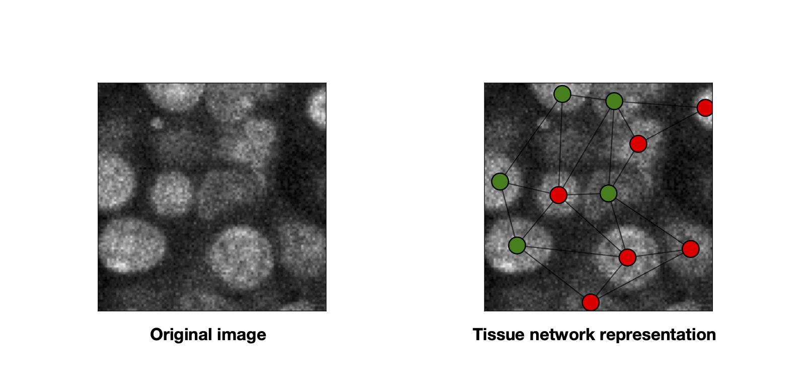

.. Griottes documentation master file, created by
   sphinx-quickstart on Thu Apr 21 11:28:47 2022.
   You can adapt this file completely to your liking, but it should at least
   contain the root `toctree` directive.

.. image:: https://github.com/BaroudLab/Griottes/actions/workflows/main.yml/badge.svg
   :target: https://github.com/BaroudLab/Griottes/actions/workflows/main.yml/badge.svg
   :alt: tests status

.. image:: https://readthedocs.org/projects/griottes/badge/?version=latest
   :target: https://griottes.readthedocs.io/en/latest/?badge=latest
   :alt: Documentation Status

===================
 🍒  Griottes 🍒 
===================

This is a tool to maximize the amount of information you can extract from your microscopy images.

**Griottes** is an easy-to-use, one-stop, Python library to extract single-cell information from your images and return the data in a networkx graph recapitulating the tissue structure.

 - It works on segmented **2D** and **3D** images, no extra fuss required! We like to use `CellPose <https://cellpose.readthedocs.io/en/latest/index.html>`_ for our image segmentation - but that's just a question of taste. You can also use dataframes as inputs.

 - On both **2D** and **3D** images you can easily insert extra information from supplementary fluorescence channels and embed the information on the graph.

**Griottes** allows you to easily generate networks from your image data as shown in the image below.

.. toctree::
   :maxdepth: 2
   :caption: Contents:

   installation
   usage
   api

Indices and tables
==================

* :ref:`genindex`
* :ref:`modindex`
* :ref:`search`
